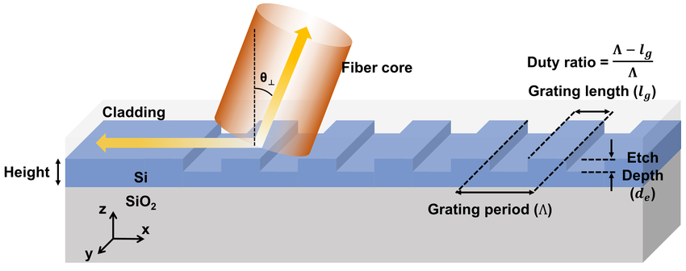
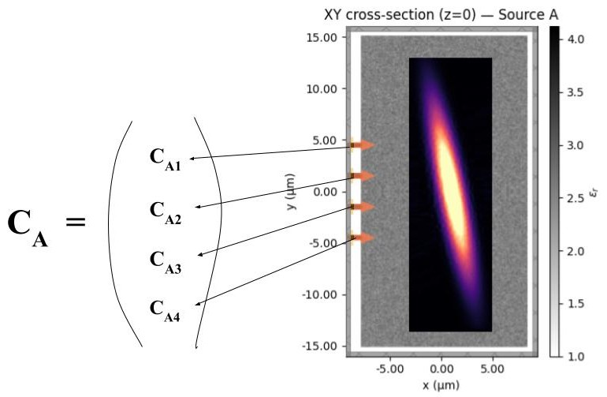
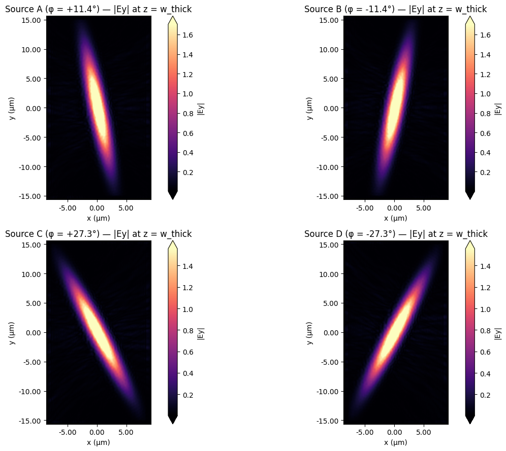
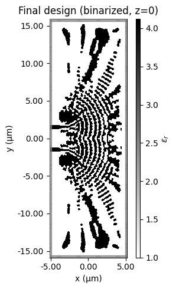
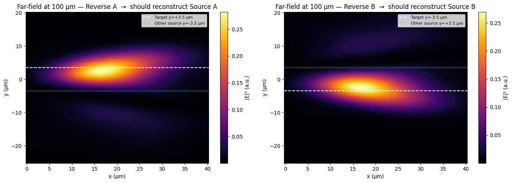

# Inverse Design of Mode-Sorter Grating Couplers

## 1. Project goal: from single-channel grating coupler to angular mode sorter

Grating couplers (GCs) are periodic diffractive structures patterned into a dielectric waveguide layer. Their purpose is to bridge two waves of light not propagating in the same plane. One is a free-space Gaussian beam arriving from above the chip at some angle, and the other a guided mode confined to a waveguide on chip. A conventional GC accomplishes this coupling for **one** input direction and routes the captured light into **one** output waveguide. The grating period is chosen to satisfy the Bragg phase-matching condition between the in-plane component of the free-space wavevector and the propagation constant of the slab mode.

The notebooks `grating_couplers/overlapping_inputs_2_input_backup.ipynb` (two-input variant) and `grating_couplers/overlapping_inputs.ipynb` (four-input variant) generalise this 1-input 1-output picture. A single grating coupler is illuminated by **N** Gaussian beams that are centered over the middle of the GC but arrive at different angles. On the chip side, there are **N** single-mode Si₃N₄ waveguides arranged symmetrically about y = 0. The design problem is to create a device such that each free-space input source produces a **coherent complex amplitude vector** $C_k$ across the N waveguides, and that the N resulting vectors are mutually orthogonal. Orthogonality here is defined as $\langle c_i | c_j \rangle$ (Hermitian Inner Product) between the waveguide-side fingerprints of two different input sources being equal to 0. If this orthogonality condition is satisfied each source can be perfectly reconstructed by injecting $C^*_k$ into the N waveguides with no bleeding into any other source.

By optical reciprocity, the same device operated in reverse acts as an angular **multiplexer**. Driving the N waveguides simultaneously with the complex conjugates of any one of the fingerprints $C_k$ reconstructs the corresponding free-space beam at the corresponding angle. The notebooks verify this explicitly in their final Time-Reversal Verification sections (Section 4 below). 

**Material system.** Both notebooks operate at a vacuum wavelength of **λ₀ = 0.729 µm**. The device layer is **Si₃N₄ (n = 2.03)** with thickness **w_thick = 0.22 µm**, sitting on a **SiO₂ buried-oxide layer (n = 1.44, thickness 0.752 µm)** atop a Si₃N₄ substrate. 

---

## 2. Inverse design: parameterisation, objective, and the symmetry trade

This device was created using **inverse design**. I highly recommend watching the following [Tidy3D Inverse Design Lectures](https://www.flexcompute.com/tidy3d/learning-center/inverse-design/) up to lecture 4.

After watching the videos the purpose of the methods shown below should make sense. All of these methods can be found in both `grating_couplers/overlapping_inputs_2_input_backup.ipynb` and `grating_couplers/overlapping_inputs.ipynb`.

1. **`enforce_y_symmetry`** - the array is averaged with its y-reversed copy, so ρ(x, y) = ρ(x, −y). This halves the effective parameter count and, critically, makes the device exactly y-mirror symmetric in the continuous limit. This is exploited in Section 3 to cut FDTD cost.
2. **`interface_buffer`** - at the chip-side edge of the design region, the parameter array is forced to ρ = 1 in narrow horizontal strips coincident with each waveguide stub. This guarantees a clean Si₃N₄ connection between the design region and the waveguides regardless of what the optimiser does elsewhere.
3. **`filter_project` × 2** - a conic spatial filter of radius 90 nm is applied, then a smoothed Heaviside projection of sharpness β maps the filtered density toward a binary distribution. The same operation is applied twice in series; the projection sharpness β is annealed from β = 1 (soft, smoothly differentiable) at iteration 10 to β = 30 (effectively binary) over the remaining 50 iterations. The conic filter enforces a minimum feature size of approximately 90 nm and rules out single-pixel artefacts that fabrication could not reproduce.
4. **`rescale`** - the filtered, projected density in [0, 1] is finally mapped linearly to the permittivity range [ε_min, ε_max] = [1.0, 4.12].

The objective function for the **two-input** variant is
$$
J(\rho) \;=\; (|c_{A,\text{top}}|^2 + |c_{A,\text{bot}}|^2) \;+\; (|c_{B,\text{top}}|^2 + |c_{B,\text{bot}}|^2) \;-\; \lambda_{\text{orth}}\,|\langle C_A | C_B\rangle|^2 \;-\; \mathcal{P}_{\text{fab}}(\rho),
$$
where ${C_a, C_b} \space \epsilon \space \Complex^2$ are the complex mode amplitudes recovered at the two waveguide mode monitors when sources A and B are excited, respectively. $\lambda_{orth}=1.0$ is the crosstalk penalty weight, and 𝒫_fab is an erosion–dilation penalty from `tidy3d.plugins.autograd.make_erosion_dilation_penalty` that discourages sub-resolution features. The first two terms reward total coupled power; the third term, which equals the squared magnitude of the Hermitian inner product between the waveguide-side fingerprints, enforces orthogonality between $C_a$ and $C_b$.

For the **four-input** variant the orthogonality term is restructured. The six raw pairwise inner products that would otherwise appear collapse, after a change of basis to symmetric and antisymmetric combinations of each mirror pair, to four independent scalar constraints:
$$
\text{crosstalk} \;=\; (|s_1|^2 - |a_1|^2)^2 \;+\; (|s_2|^2 - |a_2|^2)^2 \;+\; |\langle s_1 | s_2\rangle|^2 \;+\; |\langle a_1 | a_2\rangle|^2,
$$
where `s_1 = (C_A + C_B)/2`, `a_1 = (C_A − C_B)/2`, `s_2 = (C_C + C_D)/2`, `a_2 = (C_C − C_D)/2`. The first two terms enforce equal coupling magnitudes within each mirror pair; the last two enforce orthogonality between the symmetric and antisymmetric subspaces. The total objective adds a coupling-efficiency reward 2(|C_A|² + |C_C|²) and the same fabrication penalty.

**The mirror-symmetry trade.** 

Since `enforce_y_symmetry` makes the device exactly y-mirror symmetric, sources B and D, which are themselves the y-mirrors of sources A and C, produce waveguide-side amplitude vectors that are related to the A and C fingerprints by the index-flip operator M and a global sign `mirror_sign = ±1`:

$$
C_B \;=\; \text{mirror\_sign} \cdot M\, C_A, \qquad C_D \;=\; \text{mirror\_sign} \cdot M\, C_C.
$$

The four-input objective function launches only two FDTD simulations per iteration (sources A and C) and derives $C_B$ and $C_D$ from the sim results of sources A and C. Since `flip_y` is implemented in autograd-aware NumPy, gradient information for C_B propagates correctly back through M into the adjoint of $C_A$, and likewise for $C_D$ and $C_C$. An audit cell at the beginning of the notebook runs all four sources once on the initial parameters and prints |$C_B$ ∓ $M·C_A$| / |$C_A$| for both sign conventions; the smaller residual selects `mirror_sign`. This trade halves cloud simulation cost relative to a naive four-source loop, taking it from approximately 4.4 to ~2.2 FlexCredits per iteration.

Optimisation itself uses the **Adam** algorithm from the `optax` library with learning rate 0.2, run for 40-60 iterations. After each Adam update the parameters are clipped to [0, 1], and a checkpoint dictionary containing the loss history, parameter snapshots, gradients, optimiser states, and β schedule is pickled (the .pkl files) to disk so that the loop can resume from any point.

---

## 3. The Tidy3D workflow

The notebooks make heavy use of the `tidy3d.plugins.autograd` adjoint module. The objective function `obj(design_param, beta)` is wrapped with `autograd.value_and_grad`, and a single call to `obj` executes a complete forward FDTD simulation, captures the mode-monitor amplitudes, computes the scalar loss, and runs the corresponding **adjoint FDTD simulation** in reverse to yield the gradient dJ/dρ over the entire parameter array.

Each FDTD simulation in this project is built by `make_adjoint_sim`. It constructs:

- a computational domain of size approximately 32 µm × 33 µm × 2.0 µm with 0.6·λ PML spacing on all sides;
- three structures: the waveguides, the SiO₂ oxide layer, and the underlying Si₃N₄ substrate 
- a `td.Structure` object with material `td.CustomMedium` whose spatial permittivity profile is the rescaled ρ array, built by `update_design`. This is the design region that is optimized during the optimization loop.
- an automatic grid (`td.GridSpec.auto`) with at least 15 cells per wavelength globally, overridden inside the design region by a `MeshOverrideStructure` that enforces a uniform 20 nm cell. This matches the design-parameter grid so that each ρ pixel maps to exactly one Yee cell;
- exactly one source, an `AstigmaticGaussianBeam` with different x and y waist sizes `(w_x, w_y)` which are computed so that the tilted elliptical footprint at the source plane exactly fills the design region. 

A single iteration consists of: (i) preprocess ρ, (ii) build N/2 to N forward simulations, (iii) submit them to the cloud, (iv) extract complex amplitudes at each mode monitor, (v) form the scalar objective, (vi) execute the adjoint FDTDs to obtain dJ/dρ, (vii) apply the Adam update, (viii) clip and checkpoint. 

With β (the binarizing parameter) annealed from 1 to 30 over the first ~75% of iterations the optimiser is allowed to discover topology while the projection is soft and is then forced to commit to a binary fabricable design as the projection sharpens.

---

## 4. Verification: time-reversal and far-field overlap

Two verifications run on the final design. **Complex amplitude extraction** rebuilds the simulation with each source individually and records `C_A, C_B, …` to four decimal places The absolute values give the per-source coupling efficiency, the relative phases give the encoded angular information, and the overlap between two complex amplitude vectors `|⟨c_i | c_j⟩|` quantifies crosstalk. In the four-input variant the mirror identities are checked on the optimised design. The residuals |C_B − mirror_sign·M·C_A| / |C_A| should be of order 10⁻³ or smaller if the symmetry trade has been achieved succesfully by the optimisation.

The more physical verification is **time-reversal reconstruction**. For each fingerprint $C_k$, a new simulation is built in which N `ModeSource` objects, one at each waveguide, inject Gaussian pulses with amplitudes $C_{k,i}$ and phases $-\angle C_{k,i}$ where k refers to the source and i to an individual waveguide. The value injected at the waveguides is the complex conjugate of the recorded fingerprint for each source, $C^*_k$. A `FieldMonitor` placed 50 nm above the device captures the emitted near field, which is then projected to a Cartesian plane at $z = 100\mu m$  using `tidy3d.FieldProjector.from_near_field_monitors`. The resulting far-field intensity pattern is compared against a reference simulation containing only the original Gaussian source propagating upward through vacuum. The normalised complex overlap integral
$$
\eta_{ij} \;=\; \frac{\left|\iint \mathbf{E}^*_{\text{rev},i} \cdot \mathbf{E}_{\text{ref},j}\, dx\, dy\right|^2}{\left(\iint |\mathbf{E}_{\text{rev},i}|^2\, dx\, dy\right)\left(\iint |\mathbf{E}_{\text{ref},j}|^2\, dx\, dy\right)}
$$
gives values in $[0,1]$ $η_{ii}$ measures reconstruction fidelity for channel i, and $η_{ij}$ for $i ≠ j$ measures channel leakage. A successful device produces a strongly diagonal-dominant $η$ matrix. 

